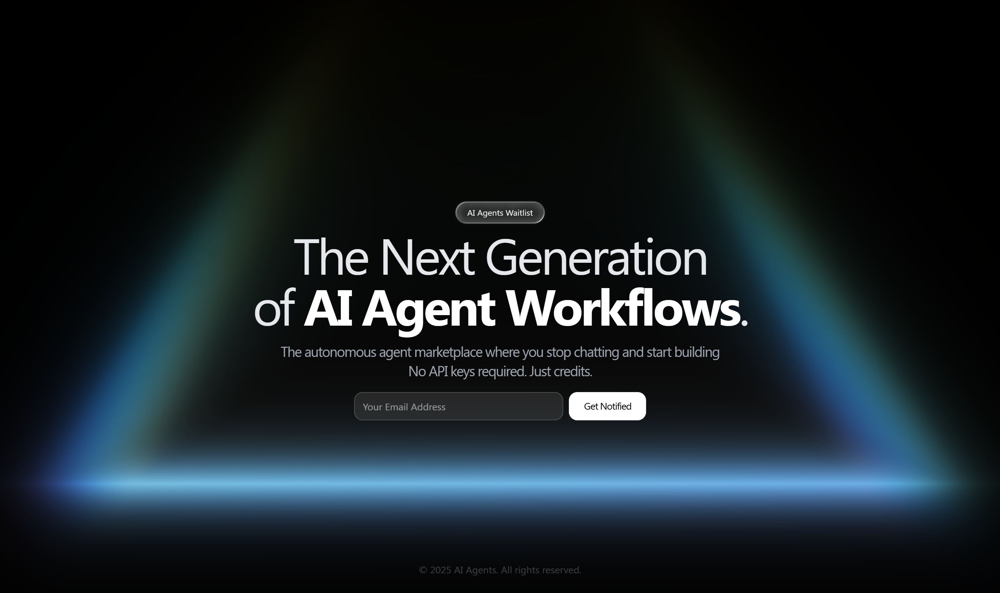

# AI Agents Waitlist

A premium, high-conversion waitlist landing page designed for cutting-edge AI startups. Built with **React 19**, **Vite**, and **Tailwind CSS**, featuring a sophisticated WebGL-powered cosmic background.



[](https://github.com/vrindaatalwar/AI-Agent-Waitlist)
[](https://opensource.org/licenses/MIT)

---

## Key Features

- **Cosmic Aesthetic**: Immersive full-screen 3D Prism background powered by **OGL (WebGL)**.
- **High Performance**: Blazing fast load times and optimized animations using **Framer Motion**.
- **Smart Waitlist Form**: 
  - Dynamic email domain autocomplete.
  - Keyboard-accessible navigation.
  - Multi-state morphing submission button.
- **Responsive Design**: Seamless experience across mobile, tablet, and desktop devices.
- **Glassmorphism UI**: Beautifully crafted buttons and inputs with liquid glass effects.

---

## Tech Stack

- **Frontend**: [React 19](https://react.dev/), [TypeScript](https://www.typescriptlang.org/)
- **Build Tool**: [Vite](https://vitejs.dev/)
- **Styling**: [Tailwind CSS](https://tailwindcss.com/)
- **Animations**: [Framer Motion](https://www.framer.com/motion/), [OGL](https://github.com/o-g-l/ogl)
- **UI Components**: [Radix UI](https://www.radix-ui.com/), [React Aria](https://react-spectrum.adobe.com/react-aria/), [Sonner](https://sonner.stevenly.me/)

---

## Getting Started

### Prerequisites
- Node.js (v18 or higher)
- npm or pnpm

### Installation

1.  **Clone the repository:**
    ```bash
    git clone https://github.com/vrindaatalwar/AI-Agent-Waitlist.git
    cd AI-Agent-Waitlist
    ```

2.  **Install dependencies:**
    ```bash
    npm install
    ```

3.  **Launch the development server:**
    ```bash
    npm run dev
    ```
    Visit `http://localhost:5173` in your browser.

---

## Customization

- **Waitlist Logic**: Update `src/components/form/WaitlistForm.tsx` to connect the `handleSubscribe` function to your backend or CRM (e.g., Mailchimp, Resend).
- **Branding**: Global design tokens and colors can be adjusted in `tailwind.config.cjs` and `src/index.css`.
- **Background**: Tune the `Prism` animation in `src/App.tsx` by adjusting props like `glow`, `speed`, and `noise`.

---

## Contributing

Contributions are what make the open-source community such an amazing place to learn, inspire, and create. Any contributions you make are **greatly appreciated**.

1. Fork the Project
2. Create your Feature Branch (`git checkout -b feature/AmazingFeature`)
3. Commit your Changes (`git commit -m 'Add some AmazingFeature'`)
4. Push to the Branch (`git push origin feature/AmazingFeature`)
5. Open a Pull Request

---

## Show your support

If you like this project, please consider giving it a Star on GitHub! It helps us reach more developers and keep building awesome templates.

## License

Distributed under the MIT License. See `LICENSE` for more information.

---

Created by VRINDDAA TALWAR
